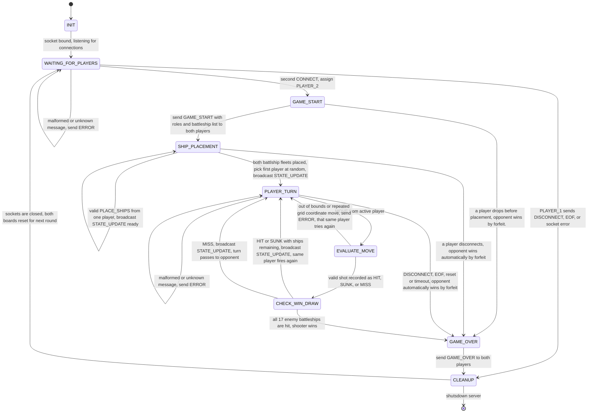

# Server Finite State Machine (FSM) specification for Battleship

**Author:** Brady Langerman
**Game:** 2 player Battleship over TCP
**Date:** 10-4-2026

## 1. State Transition Diagram

## 2. State Descriptions

| State | what server does | what it means|
|-|-|-|
| 'INIT' | initiates TCP socket, binds to the port and calls 'listen()' | Server algorithm just started |
| 'WAITING_FOR_PLAYERS' | Accepts the first connection and assigns them as 'PLAYER_1' | Lobby has either 0 or 1 players|
| 'GAME_START' | Each player receives 'GAME_START' with its role and the list of ships to place | Two players are connected |
| 'SHIP_PLACEMENT' | Validate all battelship placements and broadcasts to players when ready | Each player places down their ship (no time limit) |
| 'PLAYER_TURN' | Player sockets are read and only the player who is active may fire | Waiting for a player's MOVE |
| 'EVALUATE_MOVE' | Validate chosen coordinates, rejects repeated coordinate positions, and marks as HIT, MISS, or SUNK | The move produced from the player is checked |
| 'CHECK_WIN_DRAW' | Verifies if all 17 enemy battleship coordinates are hit, then decides the next turn | Valid shot is made on an enemy's board |
| 'GAME_OVER' | Every player connected is broadcasted with 'GAME_OVER' | A winner is declared from victory or forfeit |
| 'CLEANUP' | Close sockets, resets roles, and clear scores, shots, boards, and buffers. | Releasing all resources connected to clients |

## 3. Transition Table

| From | Event | Condition | Action | Next |
|-|-|-|-|-|
| 'INIT' | starts server | bind and listen | none | 'WAITING_FOR_PLAYERS' |
| 'WAITING_FOR_PLAYERS' | 'CONNECT' | no player connection | assign 'PLAYER_1' and next is 'LOBBY_WAIT' | 'WAITING_FOR_PLAYERS' |
| 'WAITING_FOR_PLAYERS' | 'DISCONNECT', EOF, or exception | Player 1 waiting | Remove player | 'CLEANUP' |
| 'WAITING_FOR_PLAYERS' | invalid or unknown message | none | send 'ERROR' | 'WAITING_FOR_PLAYERS' |
| 'WAITING_FOR_PLAYERS' | 'CONNECT' | one player waiting | assign 'PLAYER_2' | 'GAME_START' |
| 'GAME_START' | Players assigned roles | 'GAME_START' messages sent to players | none | 'SHIP_PLACEMENT' |
| 'GAME_START' | Disconnect | one player left | opponent wins by forfeit | 'GAME_OVER' |
| 'SHIP_PLACEMENT' | 'PLACE_SHIPS' | invalid placement | send 'ERROR INVALID_PLACEMENT' | 'SHIP_PLACEMENT' |
| 'SHIP_PLACEMENT' | 'PLACE_SHIPS' | other player not ready, valid | Broadcast 'STATE_UPDATE' (ready) | 'SHIP_PLACEMENT' |
| 'SHIP_PLACEMENT' | 'PLACE_SHIPS' | other player ready, valid | first player picked at random, broadcast 'STATE_UPDATE' | 'PLAYER_TURN' |
| 'SHIP_PLACEMENT' | 'MOVE' | Game not started | send 'ERROR WRONG_PHASE' | 'SHIP_PLACEMENT' |
| 'SHIP_PLACEMENT' | Disconnect | Either player | Opponent wins automatically by forfeit | 'GAME_OVER' |
| 'PLAYER_TURN' | 'MOVE' | message sent wasn't from active player | send 'ERROR NOT_YOUR_TURN' | 'PLAYER_TURN' |
| 'PLAYER_TURN' | Invalid or unknown message | none | send 'ERROR' | 'PLAYER_TURN' |
| 'PLAYER_TURN' | 'MOVE' | active player is sender | message forwarded to evaluation | 'EVALUATE_MOVE' |
| 'PLAYER_TURN' | 'DISCONNECT', EOF, exception, or 120 second timeout | either player | opponent wins by forfeit | 'GAME_OVER' |
| 'EVALUATE_MOVE' | Invalid coordinates or repeates coordinate | none | send 'ERROR', player tries again | 'PLAYER_TURN' |
| 'EVALUATE_MOVE' | valid shot | none | mark MISS, HIT, or SUNK | 'CHECK_WIN_DRAW' |
| 'CHECK_WIN_DRAW' | turn result | HIT or SUNK, enemy battleships still remain | Broadcast 'STATE_UPDATE', same player's turn | 'PLAYER_TURN' |
| 'CHECK_WIN_DRAW' | shot result | all 17 enemy battleships grid coordinats hit | record winner | 'GAME_OVER' |
| 'CHECK_WIN_DRAW' | shot result | MISS | Broadcast 'STATE_UPDATE', next player's turn | 'PLAYER_TURN' |
| 'GAME_OVER' | result calculated | none | Broadcast 'GAME_OVER' | 'CLEANUP' |
| 'CLEANUP' | All resources from players are released | Server continues to run | Reset game for next round | WAITING_FOR_PLAYERS |
| 'CLEANUP' | requested for server to shutdown | none | Close listenting socket | end |

## 4. Error handling/edge cases
- **Valid moves:** A MOVE is deemed valid from an active player if a coordinate on the grid is fired upon. A hit gives the same player another shot, continuing their turn. A miss passes the turn onto the next player. 
- **Invalid moves:** any coordinates outside of 0-9, negative values, floating point values, or a cell that has already been fired upon from a previous turn. returns 'ERROR INVALID_COORDINATES' or 'ERROR ALREADY_FIRED'. State gets returned to 'PLAYER_TURN' and that same player gets to try again.
- **Out-Of-Turn moves:** Server replies to the sender with 'ERROR NOT_YOUR_TURN' and the state stays 'PLAYER_TURN'. The turn doesn't change.
- **Invalid placements:** Duplicated, missing, invalid coordinates, or overlapping ships get 'ERROR INVALID_PLACEMENT'. the player gets to resubmit from the 'SHIP_PLACEMENT' state. 
- **Wrong phase:** PLACE_SHIPS during the game, or a MOVE during placement phase, gets returned with 'ERROR WRONG_PHASE'. 
- **Malformed payloads:** Missing keys, unkown message types, or invalid JSON format gets ERROR' and then discarded. The connection continues to stay open afterwards.
- **Third player ties to join:** The running game isn't effected and third player trying to join gets 'ERROR GAME_FULL'
- **Graceful disconnect:** A EOF ('recv()' returns 'b""') or a 'DISCONNECT' message after the game starts results in the room changed to 'GAME_OVER' with an outcome of 'FORFEIT' for the opponent.
- **Abrupt disconnect:** 'ConnectionAbortedError', 'TimeoutError', 'ConnectionResetError', or 'BrokenPipeError' is handles at every send and receive message exactly like a graceful disconnect, so the server continues running and doesn't crash
- **Disconnected while sending GAME_OVER:** if the remaining player inside the game leavings in the middle of 'GAME_OVER', the server continues to 'CLEANUP'. 
- **Post game reset:** Both players have their board, ship positions, shot history, scores, and boards cleared, and returns to 'WAITING_FOR_PLAYERS', for a new round to start, without having to restart the server

## 5. Role Assignment and Turn Order

1. Whatever player sends 'CONNECT' first gets assigned as 'PLAYER_1', and the second one that joins becomes 'PLAYER_2'.
2. The server randomely picks a player to go first, once both players have placed down all of their ships.
3. A player that hits a battleship grid coordinate or sinks a ship, gets to fire again. If the player misses and hits the water, it is now the opponent's turn.
4. The server produces a turn value for each player so they know whose turn it is. Server can only decide whos turn it is. The turn value produced for the clients are from the 'turn' field in 'STATE_UPDATE'.
5. The game only ends the moment one player hits all 17 enemy battleship coordinates, or when a player forfeits, so a game never can end in a draw.